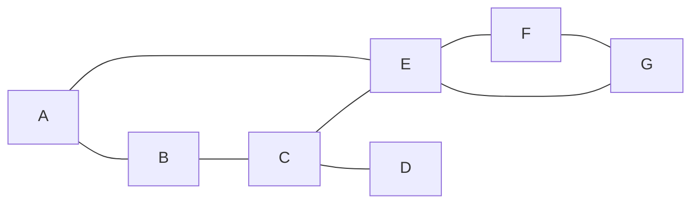

# 习题二

<center>202328015926048-丁力</center>


---

**1. 证明下列结论:**

- (1) 在一个无向图中, 如果每个顶点的度大于等于 2 , 则该图一定含有圈;

> 现在我们来证明， 假设这个图为$G(E,V)$。
>
> 首先，我们随机挑选一个节点$v_0$,由于其度数大于等于2，在无向图中，代表与其相连的边至少有两条，那么至少有一条新路径可以到达临近节点(排除已经走过的路径)，
>
> 如此以往，对于下一个，以及下下个节点$v_n$，我们总能找到一个这样的路径，但是图是有限的，所以这个路径必定也是有限的，一直选择新的路径走最后会使我们
>
> 到达已经访问过的一个节点$v_m$, 所以，至少存在一条路径$v_m...v_m$使其返回，也就是存在圈。
>
> Q.E.D. ■

- (2) 在一个有向图 \( D \) 中, 如果每个顶点的出度都大于等于 1 , 则该图一定含有一个有向圈。

> 这个证明过程和(1)类似，所以我们简单证明下，随机挑选一个节点，由于其出度大于等于1，所以至少存在一条路径使其到达下一个节点，但是由于图是有限的，
>
> 所以这个路径也是有限的，最终其也会回到已经访问过的节点从而形成一个圈。
>
> Q.E.D. ■

**2. 设 \( D \) 是至少有三个顶点的连通有向图。**

- (1) 如果 \( D \) 中包含有向的 Euler 环游（即是通过 \( D \) 中每条有向边恰好一次的闭迹), 则 \( D \) 中每一顶点的出度和入度相等。

- (2) 反之, 如果 \( D \) 中每一顶点的出度与入度都相等, 则 \( D \) 一定包含有向的 Euler 环游。
- 这两个结论是正确的吗? 请说明理由。

> 在说明这量这个结论的正确性之前, 先熟悉下这些定义：
>
> > **连通有向图**：图$D$中任何两个节点都是可以到达的。
> >
> > **Euler 环游**：在一个图中经过每一条边恰好一次并返回到起始顶点的闭合路径。这样的路径被称为欧拉回路或欧拉环游。如果存在这样的路径但不返回到起始顶点，则称为欧拉路径。
>
> <font color="orange">现在我们来说明（1）的正确性：</font>
>
> > 由于Euler环游经过了所有的边，而这个图是连通的，也就是任意两个节点都存在路径可以到达，所以所有节点都在这个Euler环游上。对于Euler环游上的任意一个节点，进入这个节点后必须
> >
> > 离开这个节点，但因为这是一个环游，起始和结束的顶点是相同的，所以每次进入 v 的次数与离开 v 的次数相等。这意味着 v 的入度和出度相等。所以任意两点的出度和入度都相等，所以这个结论是**正确**的。
>
> <font color="orange">现在我们来说明（2）的正确性：</font>:
>
> > 由于每个顶点的出度和入度相等，并且图是连通的，我们可以从任意顶点开始，沿着任意边移动，并且总是能够找到返回到起始顶点的路径。因为我们总是能够继续前进，直到我们回到起始顶点，并且每条边只被访问一次，所以这是一个 Euler 环游。所以这个结论是**正确**的。

- 如果 \( G \) 是至少有三个顶点的无向图, 则 \( G \) 包含 Euler 环游的条件是什么?

> 连通和每个节点的度数为偶数，因为连通保证了任意两点可以相互到达，偶数度数保证从一条边进入这个节点后可以从另一个新的边出去， 从而形成Euler环游。

**3. 设 \( G \) 是具有 \( n \) 个顶点和 \( m \) 条边的无向图, 如果 \( G \) 是连通的, 而且满足 \( m=n-1 \), 证明 \( G \) 是树。**

首先，我们证明一个含有`n`节点的无向图的使其连通的最少边的数量为`n-1`：

> 在无向图中，为了保持 n 个节点的连通性，至少需要 n-1 条边。这是因为，为了确保所有节点都是连通的，每个新加入的节点至少需要一条边与已有的图连接。这样，当加入第一个节点时不需要边，加入第二个节点时需要一条边，加入第三个节点时需要两条边，依此类推，直到加入第 n 个节点时，需要 n-1 条边。

现在我们来分析证明原命题：

> 我们知道，不含圈的连通图就是`树`，所以要证明**G**是树，也就是证明，**G**中不含有圈。 假设**G**中含有圈，那么我们假设这个圈是由`g`个节点构成的，那么
>
> 将消耗`g`条边($g\leq m$)，在无向图中，圈中的节点都是连通的，目前还有`n-1-g`条边和`n-g`个节点，其中至少要消耗一条边保证剩下的`n-g`个节点与`g`节点
>
> 所组成的圈连通，那么还有`n-2-g`条边和`n-g`个节点， 要保证这`n-g`个节点连通，但是使得`n-g`个节点连通至少需要`n-g-1`条边，但是目前边只有`n-2-g`条，
>
> 所以无法形成连通。 也就是假设存在有圈的情况下使得原无向图无法连通，矛盾！所以这个图不含有圈，也就是说，其为树。
>
> Q.E.D. ■


当然，我们也可以换一种思路，用数学归纳法来证明：

> 1. **基础步骤**:
>     - 当 $ n = 1 $ 时，图 $ G $ 只有一个顶点和零条边，它是一棵树。
>     - 当 $ n = 2 $ 时，图 $ G $ 有两个顶点和一条边，它也是一棵树。
>
> 2. **归纳假设**:
>     - 假设对于所有的 $ k $ (其中 $ k $ 是一个正整数且 $ k \geq 2 $)，如果一个图有 $ k $ 个顶点和 $ k-1 $ 条边且是连通的，那么它是一棵树。
>
> 3. **归纳步骤**:
>     - 现在考虑一个具有 $ k+1 $ 个顶点和 $ k $ 条边的连通图 $ G $。
>     - 如果从图 $ G $ 中去掉一个顶点和与它相连的一条边，我们将得到一个具有 $ k $ 个顶点和 $ k-1 $ 条边的新图 $ G' $。
>     - 根据归纳假设，图 $ G' $ 是一棵树。
>     - 现在，我们将先前移除的顶点和边重新添加到图 $ G' $ 中，得到原图 $ G $。由于我们只添加了一个顶点和一条边，并且没有形成新的环，图 $ G $ 仍然是一棵树。
>
> 通过这个归纳过程，我们可以得出结论：对于所有的 $ n $（其中 $ n \geq 1 $），如果一个图 $ G $ 具有 $ n $ 个顶点和 $ n-1 $ 条边且是连通的，那么它是一棵树。
>
> Q.E.D. ■

**4. 下面的无向图以邻接链表存储, 而且在关于每个顶点的链表中与该顶点相邻的顶点是按照字母顺序排列的。试以此图为例描述讲义中算法 DFNL 的执行过程。**



> 按照给定的图和DFNL算法，我们可以得到以下的执行过程：
>
> 1. 从节点A开始，初始化DFN和Low为1。
> ```
> DFN[A] = 1, Low[A] = 1
> ```
>
> 2. 访问A的邻居B。
> ```
> DFN[B] = 2, Low[B] = 2
> ```
>
> 3. 接着访问B的邻居C。
> ```
> DFN[C] = 3, Low[C] = 3
> ```
>
> 4. 访问C的邻居D。
> ```
> DFN[D] = 4, Low[D] = 4
> ```
>
> 5. D没有其他邻居，所以返回到C。接着访问C的下一个邻居E。
> ```
> DFN[E] = 5, Low[E] = 5
> ```
>
> 6. 访问E的邻居F。
> ```
> DFN[F] = 6, Low[F] = 6
> ```
>
> 7. 接着访问F的邻居G。
> ```
> DFN[G] = 7, Low[G] = 7
> ```
>
> 8. G的邻居E和F都已经被访问过了，但E是G的回退边，所以Low[G]更新为DFN[E]。
> ```
> Low[G] = 5
> ```
>
> 9. 返回到F，F的邻居E和G都已经被访问过了，但E是F的回退边，所以Low[F]更新为DFN[E]。
> ```
> Low[F] = 5
> ```
>
> 10. 返回到E，E的邻居A、C、F和G都已经被访问过了，但A是E的回退边，所以Low[E]更新为DFN[A]。
> ```
> Low[E] = 1
> ```
>
> 11. 返回到C，C的邻居B、D和E都已经被访问过了，但B是C的回退边，所以Low[C]更新为DFN[B]。
> ```
> Low[C] = 2
> ```
>
> 12. 返回到B，B的邻居A和C都已经被访问过了，但A是B的回退边，所以Low[B]更新为DFN[A]。
> ```
> Low[B] = 1
> ```
>
> 13. 返回到A，A的邻居B和E都已经被访问过了，所以Low[A]不变。
>
> 最终结果为：
> ```
> DFN: A=1, B=2, C=3, D=4, E=5, F=6, G=7
> Low: A=1, B=1, C=2, D=4, E=1, F=5, G=5
> ```
>
> 下面我们通过编程来实现：
>
> ```python
> from collections import defaultdict
> 
> 
> class Graph:
>     def __init__(self):
>         self.graph = defaultdict(list)
>         self.time = 0
> 
>     def add_edge(self, u, v):
>         self.graph[u].append(v)
>         self.graph[v].append(u)
> 
>     def dfs_visit(self, v, parent, visited, dfn, low):
>         visited[v] = True
>         self.time += 1
>         dfn[v] = self.time
>         low[v] = self.time
> 
>         for neighbor in self.graph[v]:
>             if not visited[neighbor]:
>                 self.dfs_visit(neighbor, v, visited, dfn, low)
>                 low[v] = min(low[v], low[neighbor])
>             elif neighbor != parent:
>                 low[v] = min(low[v], dfn[neighbor])
> 
>     def dfnl(self, v):
>         visited = {node: False for node in self.graph}
>         dfn = {node: None for node in self.graph}
>         low = {node: None for node in self.graph}
>         self.dfs_visit(v, None, visited, dfn, low)
>         return dfn, low
> 
> 
> g = Graph()
> g.add_edge('A', 'B')
> g.add_edge('A', 'E')
> g.add_edge('B', 'C')
> g.add_edge('C', 'D')
> g.add_edge('C', 'E')
> g.add_edge('E', 'F')
> g.add_edge('E', 'G')
> g.add_edge('F', 'G')
> 
> dfn_result, low_result = g.dfnl('A')
> print("DFN:", dfn_result)
> print("Low:", low_result)
> ```
>
> 其输出为：
>
> ```bash
> DFN: {'A': 1, 'B': 2, 'E': 5, 'C': 3, 'D': 4, 'F': 6, 'G': 7}
> Low: {'A': 1, 'B': 1, 'E': 1, 'C': 1, 'D': 4, 'F': 5, 'G': 5}
> ```
>
> 可以看出，其输出结果和我们预期的一样，结果是对的。


**5. 对图的另一种检索方法是 D-Search。该方法与 BFS 的不同之处在于将队列换成栈, 即下一个要检测的节点是最新加到未检测节点表的那个节点。**

- (1) 写一个 D-Search 算法;
- (2) 证明由节点 \( v \) 开始的 D-Search 能够访问 \( v \) 可到达的所有节点;
- (3) 你的算法的时、空复杂度是什么?

> **(1) D-Search算法：**
>
> D-Search（Depth-First Search，也称为深度优先搜索）是一种使用栈的图遍历算法。以下是D-Search算法的Python实现：
>
> ```python
> from collections import defaultdict
> 
> class Graph:
>     def __init__(self):
>         self.graph = defaultdict(list)
> 
>     def add_edge(self, u, v):
>         self.graph[u].append(v)
> 
>     def d_search(self, start):
>         visited = set()
>         stack = [start]
> 
>         while stack:
>             vertex = stack.pop()
>             if vertex not in visited:
>                 visited.add(vertex)
>                 stack.extend([neighbor for neighbor in self.graph[vertex] if neighbor not in visited])
> 
>         return visited
> ```
>
> **(2) 证明：**
>
> 为了证明由节点 \( v \) 开始的D-Search能够访问 \( v \) 可到达的所有节点，我们可以使用归纳法。
>
> 基本情况：对于与 \( v \) 直接相邻的任何节点，它们都会被加入到栈中并在下一次迭代中被访问。
>
> 归纳步骤：假设D-Search已经访问了从 \( v \) 开始的所有可到达的节点到深度 \( k \)。当我们访问深度 \( k \) 的节点时，我们也会将其所有未访问的邻居加入到栈中。因此，在下一次迭代中，深度 \( k + 1 \) 的所有节点也会被访问。
>
> 由于D-Search会继续执行，直到栈为空，这意味着它会访问从 \( v \) 开始的所有可到达的节点。
>
> **(3) 时、空复杂度：**
>
> - 时间复杂度：对于每个节点和每条边，D-Search都会访问它们一次。因此，时间复杂度是 \( O(V + E) \)，其中 \( V \) 是顶点的数量，\( E \) 是边的数量。
>
> - 空间复杂度：在最坏的情况下，所有的节点都可能被加入到栈中，因此空间复杂度是 \( O(V) \)。此外，我们还需要一个集合来跟踪已访问的节点，这也需要 \( O(V) \) 的空间。因此，总的空间复杂度是 \( O(V) \)。

---

---